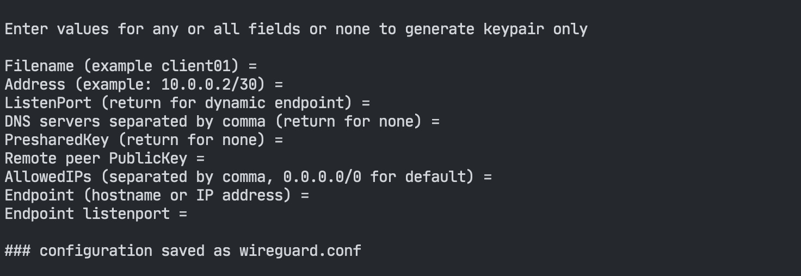

# wgconfig
A simple bash script to output wireguard configurations with public and private key.



cat wireguard.conf:

```bash
[Interface]
PrivateKey = 2G7RWEI9AkU/jsydtRyf2OQKLurUci23XETa3+hFxE0=
# Publickey = XUgAaEiZNCLqOEfcPikeX2dokZwTjuNk1pnb+OgB1DQ=
Address =
# MTU = 1420

[Peer]
PublicKey =
AllowedIPs =
Endpoint = :
# PersistentKeepalive = 25
```
## Installation and usage

Clone the repo or copy the script.<br>
Make the script executable `chmod +x wgconfig`.<br>
Place it somewhere in your path `~/bin` `~/.local/bin` or `/usr/local/bin`.<br>

There are no command line flags or options, just execute the script and follow the prompts.

## Requirements

- wireguard-tools
  - Linux (debian based)
    - `apt install wireguard-tools`
  - macOS Macports and Homebrew
    - `port install wireguard-tools`
    - `brew install wireguard-tools`
  - FreeBSD
    - `pkg install wireguard-tools`

For additional operating systems: [Wireguard Installation](https://www.wireguard.com/install/)

## Further Information

- [WireGuard](https://www.wireguard.com/)
- [Unofficial WireGuard Documentation](https://github.com/pirate/wireguard-docs)
